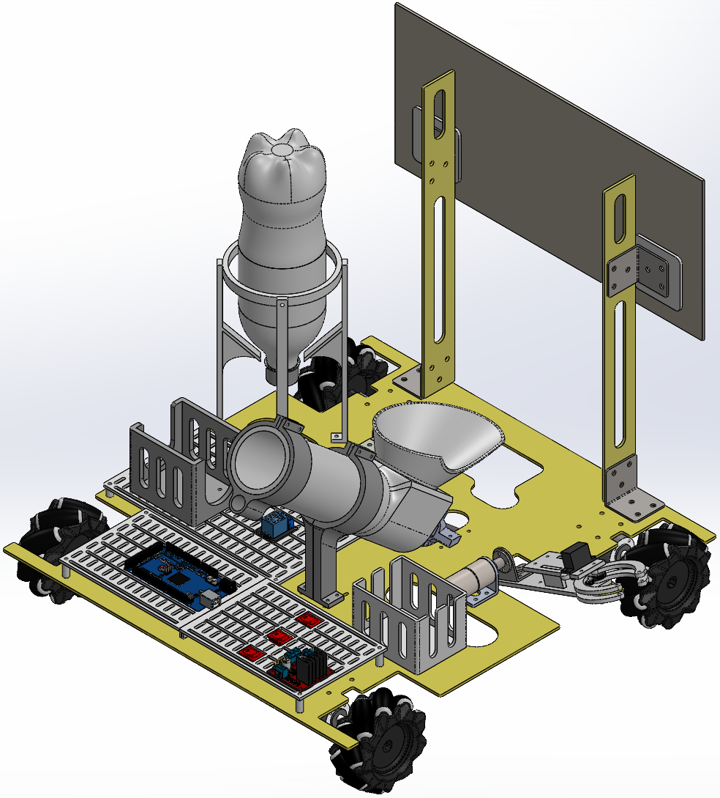

# “追求卓越”队 华中科技大学第22届校机器人大赛电控代码
## 项目介绍

本项目为追求卓越战队参加华中科技大学第22届校机器人大赛的电控代码。团队获得比赛冠军。

此分支`R1`为**机器人R1**的电控代码，主要实现了PS2手柄控制、底盘控制、机械臂控制以及气缸发射控制的相关功能。

项目基于`IntelliJ CLion IDE`进行开发，配合`PlatformIO`插件进行嵌入式开发，面向`Arduino Mega 2560`开发板，烧录入开发板的代码位于`\src\main.cpp`。

**此分支**`R1`**为机器人R1的电控代码**。关于**机器人R2**的电控代码请移步至分支`R2`。



## 使用说明
本项目所使用的库有：
- `Arduino_Builtin`: 用于控制Arduino板的基础库（内部库，无需额外安装）
- `PS2X_lib`: 用于控制PS2手柄（外部）| [Github界面](https://github.com/madsci1016/Arduino-PS2X)
- `Emakefun_MotorDriverBoard`: 用于扩展板`MotorDriverBoard`的驱动代码库（外部）| [Github界面](https://github.com/emakefun/MotorDriverBoard)

本项目使用的外部库位于文件夹`\lib`下。

## 功能实现介绍
### 扩展版

本此机器人开发使用`Arduino Mega 2560`开发板配合`Emakefun_MotorDriverBoard`扩展板开发。其中扩展版承担了四路直流电机的驱动、PS2X模块的安装以及舵机的驱动。

以下代码段为扩展版的相关对象声明。
```c++
Emakefun_MotorDriver mMotorDriver = Emakefun_MotorDriver(0x60); // 电机对象定义
Emakefun_DCMotor *RF = mMotorDriver.getMotor(M1);
Emakefun_DCMotor *LF = mMotorDriver.getMotor(M2);
Emakefun_DCMotor *RB = mMotorDriver.getMotor(M3);
Emakefun_DCMotor *LB = mMotorDriver.getMotor(M4);
Emakefun_Servo *ClampServo = mMotorDriver.getServo(8);
```
扩展版的相关图片可见下，相关接口介绍参见其库的[README.md](https://github.com/emakefun/MotorDriverBoard/blob/master/README.md)。


使用扩展板的目的在于其可以较大地简化接线，高度集成从而避免过度飞线，使电路较简单整洁，且易于维护和修改。

### 手柄控制

手柄的接收模块可以直接插于扩展板的相关接口上，配置接口由扩展板库文件处理，只需声明PS2X对象即可。

```c++
PS2X ps2x; // PS2对象定义
```

### 底盘控制

底盘控制结合了PS2X手柄的摇杆控制。速度控制使用`Emakefun_DCMotor`类的函数`run()`控制方向，`setSpeed()`设置速度。

通过摇杆的位置读取来控制各轮子的方向及速度，可参见函数`calculateChassis()`。

### 机械臂控制

机械臂有两部分需要电控：
- **舵机**: 使用扩展版上的舵机接口`S8`，直接使用类`Emakefun_Servo`的函数`writeServo()`控制角度。
- **电机**: 电机为低转速大扭矩的直流电机，使用传统的L298N电机驱动模块控制，因其不需要PWM信号调速所以直接使用两根信号线与开发板相连。接口详见`#define`定义。

### 气缸控制

气缸的主要难点在于气路的搭建，电控部分较易，即直接使用继电器控制电磁阀与24V电池的通断即可。
